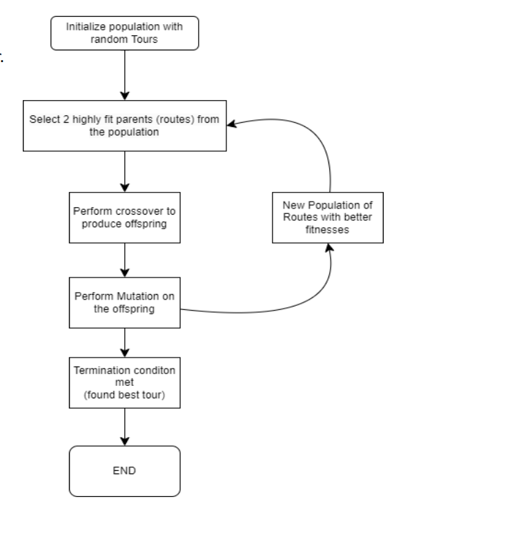
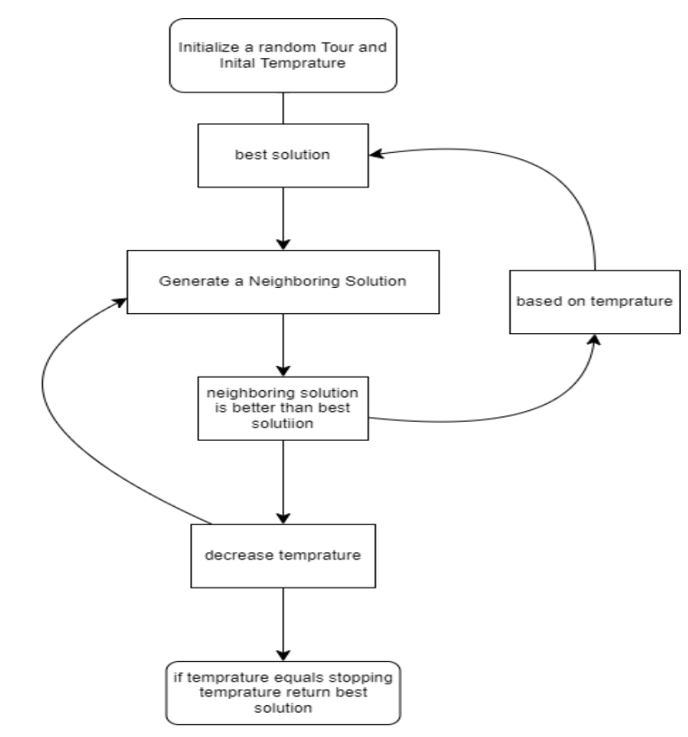
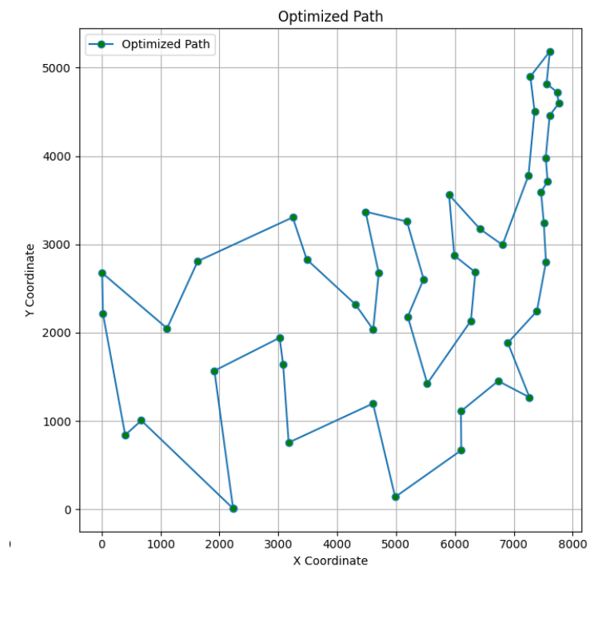
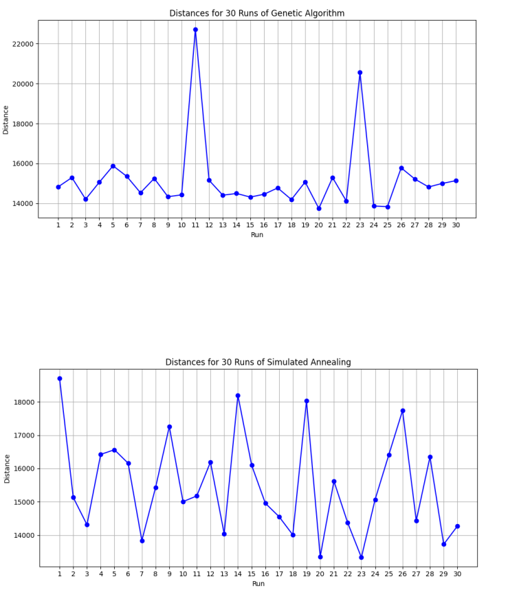

# Solving the Travelling Salesman Problem (TSP) with Genetic Algorithm (GA) and Simulated Annealing (SA)

## Introduction

The **Travelling Salesman Problem (TSP)** is a classic optimization problem where a salesman must visit all cities exactly once and return to the starting point, aiming for the shortest possible route. The TSP is **NP-hard**, meaning that no efficient algorithm exists to solve it exactly for large instances. Therefore, heuristic approaches like **Genetic Algorithm (GA)** and **Simulated Annealing (SA)** are commonly used.

In this project, we compare **GA** and **SA** in solving the **ATT48 TSP problem**, evaluating their performances based on **distance optimization** and **computational efficiency**.

---

## Algorithms Used

### Genetic Algorithm (GA)

The **Genetic Algorithm (GA)** is an evolutionary optimization method inspired by natural selection. It operates through:
- **Selection**: Choosing the fittest individuals.
- **Crossover**: Combining individuals to produce new solutions.
- **Mutation**: Randomly modifying solutions to maintain diversity.

#### GA Process Flowchart


### Simulated Annealing (SA)

**Simulated Annealing (SA)** is a probabilistic optimization technique inspired by the annealing process in metallurgy. It allows worse solutions to be accepted temporarily to escape local optima.

#### SA Process Flowchart


---

## Optimal Solution Found

After running the **Genetic Algorithm** multiple times with optimized parameters, the shortest route for the **ATT48 dataset** was found, achieving a total distance **less than 11,000**. The **optimized path** is shown below:



---

## Comparative Analysis

To determine which algorithm performs better, **30 independent runs** were conducted for each method. The statistical comparison using the **Wilcoxon signed-rank test** showed that **GA and SA achieved comparable results**, but **GA performed slightly better in terms of lower average distance**.

### Comparison of GA vs SA
- **GA Average Distance**: **15,199.43**
- **SA Average Distance**: **15,612.1**
- **Wilcoxon p-value**: **0.061 (No significant difference)**

#### GA vs SA Performance Comparison


---

## Running the Project

### 1️⃣ Setup the Environment
First, create a virtual environment (venv) to manage dependencies:
```bash
python -m venv tsp_env
source tsp_env/bin/activate  # On Windows use tsp_env\Scripts\activate
pip install -r requirements.txt
